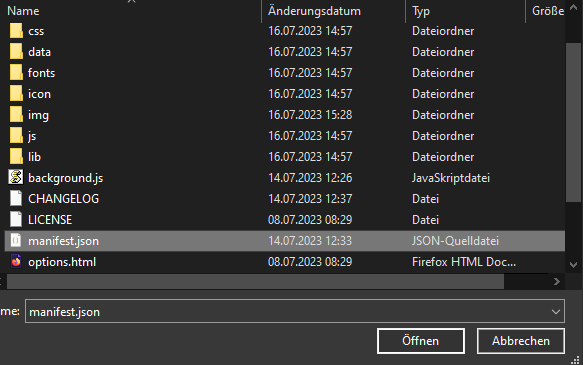

<h1 align="center"> RapidJournalQualCheck </h1> 
<h3 align="center"> Rapid Quality Check for Academic Journals in Google Scholar Search Results </h3>
 

    

<b> This is a Firefox port of the Chrome extension by [Dr.Wichmann](https://de.linkedin.com/in/julianwichmann) to display SJR along with the H-Index and CCF score next to Google Scholar search results. </b>

For the original post see [here](https://de.linkedin.com/posts/julianwichmann_google-scholar-extension-activity-6967463018607611904-nsbm)

 Based on and adapted from CCFrank by WenyanLiu: https://github.com/WenyanLiu/CCFrank4dblp
  Using the public Crossref API: https://api.crossref.org/swagger-ui/index.html
  Using the public dblp API: https://dblp.org/
  Using Australian Business Deans Council (ABDC) list: https://abdc.edu.au/research/abdc-journal-quality-list/
  Using Academic Journal Guide (AJG) by the Chartered Association of Business Schools (C_ABS): https://charteredabs.org/academic-journal-guide-2021/
  Using Bibliometriske Forskningsindikator (BFI) of the Danish Ministry of Higher Education and Science ranking: ufm.dk
  Using Ranking of the Chinese Computer Foundation (CCF): https://www.ccf.org.cn/en/Bulletin/2019-05-13/663884.shtml
  Using CNRS ranking: https://www.gate.cnrs.fr/spip.php?rubrique31&lang=en
  Using Foundation National pour l’Enseignement de la Gestion des Enterprises (FNEGE) ranking: https://www.fnege.org/classement-des-revues-scientifiques-en-sciences-de-gestion/
  Using Financial Times (FT) research rank:
  Using High Council for Evaluation of Research & Higher Education (HCERES) ranking: https://www.hceres.fr/sites/default/files/media/downloads/2020-liste-hceres-domaine-shs1-economie-et-gestion_0.pdf
  Using SCImago Journal & Country Rank (retrieved July 20th, 2022): http://www.scimagojr.com
  Using CORE journal and conference ranking: http://portal.core.edu.au/jnl-ranks/
  Using Financial Time's FT50 ranking: https://www.ft.com/content/3405a512-5cbb-11e1-8f1f-00144feabdc0
  Icons from Flaticon.com: https://www.flaticon.com/free-icons/research

## Preview

Journal rankings are directly added to Google Search results.
 

  Currently includes a broad range of rankings. Please check the links above for more information on each ranking. The colors also indicate quality from green (higher quality) to red (lower quality).

  Hovering with your cursor over the ranking scores gives you additional information such as the journals h-index and the name of the journal that was identified based on the input from Google Scholar.

  Clicking on the ranking scores takes you to the identified work via its DOI. This along with the identified journal name helps you to check, whether indeed the correct journal was identified based on the Google Scholar input.

## Install

<b> Coming soon </b>  
<b> Workaround </b>  
First ensure that the whole repository exists on your local machine.
You can temporarily install the addon under Firefox by visiting about:debugging#/runtime/this-firefox in your browser and clicking on "Load Temporary Add-on...".

  Next you have to navigate to the folder where you installed the repo to and select the "manifest.json" file.

  Finally, in the top right corner you can navigate to the addon settings and set the permissions for the google scholar sites you're using (e.g. https://scholar.google.ch).

## What's New

## Contributors ✨

This package is based on the Chrome extension by Dr. Julian R. K. Wichmann and in turn on CCFrank by WenyanLiu: https://github.com/WenyanLiu/CCFrank4dblp
Thanks goes to them and their contributors: https://github.com/WenyanLiu/CCFrank4dblp#contributors-

 Using the public Crossref API: https://api.crossref.org/swagger-ui/index.html

 Using SCImago Journal & Country Rank (retrieved July 20th, 2022): http://www.scimagojr.com
  Using VHB-JOURQUAL3 ranking: https://vhbonline.org/en/vhb4you/vhb-jourqual/vhb-jourqual-3

 Using China Computer Federation (CCF) ranking: https://www.ccf.org.cn/en/Bulletin/2019-05-13/663884.shtml

 Icons from Flaticon.com: https://www.flaticon.com/free-icons/research

Contributions of any kind welcome!

## Reports
